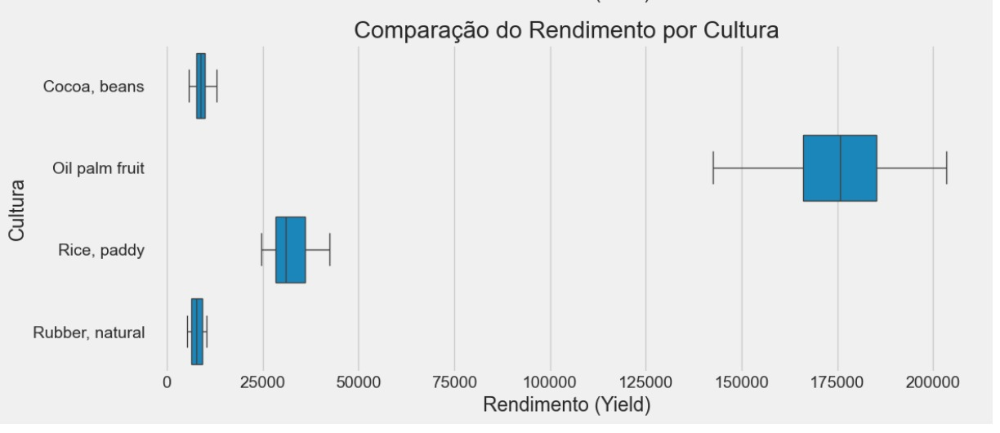
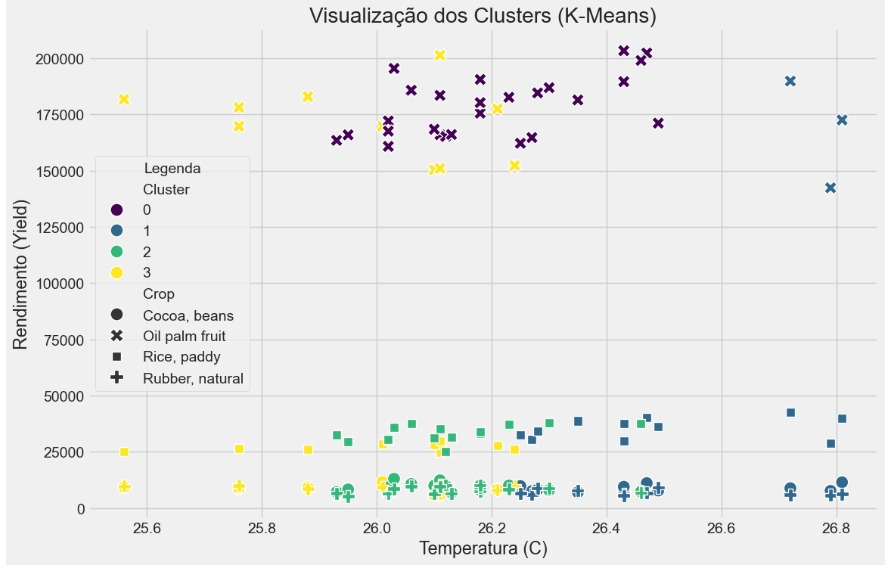
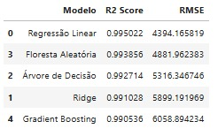

# FIAP - Faculdade de Informática e Administração Paulista

<p align="center">
<a href= "https://www.fiap.com.br/"></a>
</p>

<br>


# Nome do projeto

CAP 1 - FarmTech na era da cloud computing

## Nome do grupo

Grupo 25

## 👨‍🎓 Integrantes:

- <a href="https://www.linkedin.com/in/anacornachi/">Ana Cornachi</a>
- <a href="https://www.linkedin.com/in/carlamaximo/">Carla Máximo</a>

## 👩‍🏫 Professores:

### Tutor(a)

- <a href="https://www.linkedin.com/in/lucas-gomes-moreira-15a8452a/">Lucas Gomes Moreira</a>

### Coordenador(a)

- <a href="https://www.linkedin.com/in/andregodoichiovato/">André Godoi Chiovato</a>

## 📜 Descrição

Este projeto foi desenvolvido para a empresa fictícia FarmTech Solutions, com o objetivo de analisar dados de uma fazenda de médio porte. Utilizando um dataset com informações sobre clima, solo e tipo de cultura (`crop_yield.csv`), aplicamos técnicas de Ciência de Dados e Machine Learning para extrair insights valiosos e construir modelos preditivos.

## 🎯 Objetivo do Projeto

A meta principal foi desenvolver uma solução de ponta a ponta, que inclui:

1.  **Análise Exploratória de Dados (EDA):** Para entender a estrutura dos dados, identificar padrões e visualizar as relações entre as variáveis.
2.  **Clusterização Não Supervisionada:** Para encontrar tendências e cenários de produção distintos (outliers) de forma automática, utilizando o algoritmo K-Means.
3.  **Modelagem Preditiva (Regressão):** Para construir e avaliar cinco modelos de Machine Learning diferentes, com o objetivo de prever o rendimento da safra (`Yield`) com base nas condições fornecidas.

## 🛠️ Tecnologias Utilizadas

-   **Linguagem:** Python 3
-   **Análise de Dados:** Pandas, NumPy
-   **Visualização de Dados:** Matplotlib, Seaborn
-   **Machine Learning:** Scikit-learn
-   **Ambiente:** Jupyter Notebook (via Anaconda)

## 🚀 Etapas do Projeto e Principais Descobertas

### 1. Análise Exploratória de Dados (EDA)

Nesta fase, descobrimos o fator mais crítico do dataset: a **influência dominante do tipo de cultura (`Crop`) sobre o rendimento (`Yield`)**.

-   **Qualidade dos Dados:** O dataset se mostrou de alta qualidade, sem nenhum valor nulo.
-   **Distribuição Bimodal:** A variável `Yield` possui dois grupos distintos: um de baixo rendimento e um de altíssimo rendimento.
-   **A Causa da Separação:** O gráfico abaixo revelou que a cultura **`Oil palm fruit`** tem um rendimento ordens de magnitude maior que as demais, explicando a distribuição bimodal.

 

### 2. Clusterização com K-Means

Para validar a descoberta da EDA, aplicamos o K-Means para ver se um algoritmo não supervisionado conseguiria encontrar esses grupos.

-   **Método do Cotovelo:** O método sugeriu a existência de 2 a 4 clusters como ideais.
-   **Resultado (k=4):** O algoritmo conseguiu, com sucesso, **isolar a `Oil palm fruit` em seu próprio cluster**, confirmando que ela representa uma "tendência" matematicamente distinta das outras culturas.



### 3. Modelagem Preditiva (Regressão)

A fase final consistiu em treinar 5 modelos para prever o `Yield`.

-   **Pré-processamento:** A variável `Crop` foi transformada em formato numérico através de **One-Hot Encoding**.
-   **Divisão Treino-Teste:** Os dados foram divididos em 80% para treino e 20% para teste, garantindo uma avaliação justa.
-   **Resultados:** Todos os modelos tiveram desempenho excepcional (R² > 0.99), devido à forte capacidade preditiva da variável `Crop`.

#### 🏆 **Modelo Campeão:** **Floresta Aleatória (`RandomForestRegressor`)**

O modelo de Floresta Aleatória foi o vencedor, alcançando o maior **R² Score de 0.9938**, o que significa que ele explica **99.38%** da variação no rendimento da safra.



---

## 🚀 Como Executar

Para replicar esta análise, siga os passos:

1.  **Clone o repositório:**
    ```bash
    git clone [(https://github.com/carlamaximo/FIAP-F5-C1.git)] - HTTPS ou [(git@github.com:carlamaximo/FIAP-F5-C1.git)] - SSH
    ```
2.  **Pré-requisitos:**
    -   Tenha o **Anaconda Distribution** instalado.
3.  **Inicie o Jupyter:**
    -   Abra o **Anaconda Prompt**.
    -   Navegue até a pasta do projeto.
    -   Execute o comando `jupyter notebook`.
4.  **Execute o Notebook:**
    -   Abra o arquivo `.[ipynb]`(https://github.com/carlamaximo/FIAP-F5-C1/blob/main/CarlaMaximo_rm564845_pbl_fase5.ipynb) no seu navegador.
    -   Execute as células sequencialmente para ver todo o processo.

---

## 🔮 Vídeo de Demonstração no YouTube

Confira a apresentação do projeto, com a explicação detalhada de cada etapa e dos resultados obtidos.

*   **➡️ [Link para o vídeo (YouTube)]([https://www.youtube.com/watch?v=HJHWRCWvx00])**


